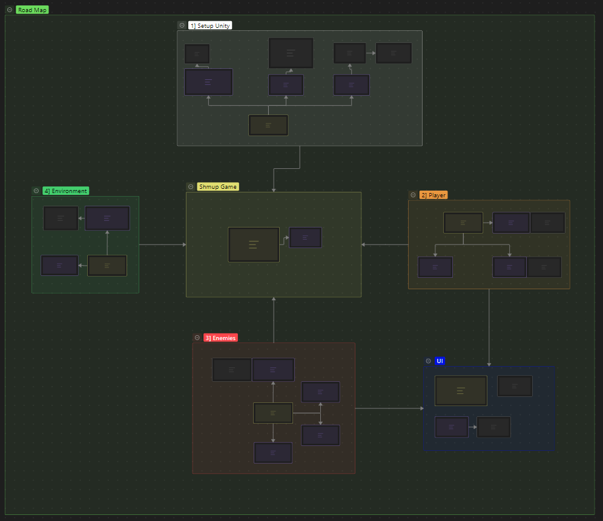

# Unity Intro Class : Shmup

## 1] Resources

-This repo's code base can be used as a reference for the project 
-[Unity Website](https://unity.com/fr) 
-[Unity Manual](https://docs.unity3d.com/Manual/index.html) 
-[C# Naming Conventions](https://learn.microsoft.com/en-us/dotnet/csharp/fundamentals/coding-style/identifier-names) 
-[YT : 3 Laws of writing readable code](https://www.youtube.com/watch?v=-AzSRHiV9Cc) 

State of AI Games/Generation : 
-[Racing Game](https://www.reddit.com/r/aigamedev/comments/1smm7hl/i_had_claude_code_build_me_a_3d_formula1_racing/) 
-[Portal Game](https://www.reddit.com/r/aigamedev/comments/1sspoe4/this_portal_clone_is_created_with_10_prompts/)

### Assets Used

Itch.io : 
-[Player](https://foozlecc.itch.io/void-main-ship) 
-[Enemies](https://foozlecc.itch.io/void-fleet-pack-1) 
-[Background](https://screamingbrainstudios.itch.io/seamless-space-backgrounds) 
-[Music](https://alkakrab.itch.io/free-sci-fi-music-2) 

OpenGameArt : 
-[Explosion](https://opengameart.org/content/explosion-8) 

Freesound : 
-[Laser Sound](https://freesound.org/people/alphatrooper18/sounds/362421/) 

### Find More Assets

-[CraftPix](https://craftpix.net/) 
-[OpenGameArt](https://opengameart.org/) 
-[Itch.io Game Assets](https://itch.io/game-assets) 
-[Freedound](https://freesound.org/) 

### Useful Shortcuts

-Ctrl + C -> V = Copy, Paste 
-Ctrl + X = Cut 
-Ctrl = Block Mode 
-Shift = Select Mode 
-Alt + Vertical Arrows = Move Line 

## 2] To go Further

Game : 
-Use Inheritence (Object Oriented Programming = OOP) to better define the enemy types 
-Add Weapons / Bonus 
-Pause Menu 
-Main Menu (Scene loader) 

Publish : 
-Upload on GitHub 
-Build WebGl Version 
-[Publish on Github Pages](https://www.youtube.com/watch?v=4jvGgn4b1V8) 
-[Publish Playable Version on Itch.io](https://www.youtube.com/watch?v=8iApGVX--B0) 

-[Official Unity .gitignore](https://github.com/github/gitignore/blob/main/Unity.gitignore) 

## 3] Course Definition

### Design Goals

-Discover Basic (Game) Programming with Visual Feedbacks 
-Access to Resources to go further 
-Build a playable/shareable Game (Windows version) 

### Learning Goals

-Unity Basics 
-if 
-array 
-Loops (for, while) 
-function 
-Applied Maths in Game Programming (Velocity, sin) 

### Road Map

Game Element -> Learning 
1] Player Movement -> if, conditions, functions, array, Inputs, Translation, Velocity, DeltaTime 
2] Player Shoot -> List, while loop, Prefab, Instantiation 
3] Enemy Spawner -> RNG, for loop 
4] Scout Enemy -> Collision 
5] Frigate Enemy -> Sin() Movement / Applied Maths 
6] Add Sounds 
7] Build Project (Windows) 

### SX (Student Experience)

-The incomplete web version is presented at the beginning of the course 
-> Define goal, incomplete versions motivate completion : 

 

-A road map is displayed during the whole course as a visual and spatial reference of the progress 
(Inspired by DR.Stone's road maps) 

 

### Default/Giga mode

-Default = Course version 
-[Giga Version](https://github.com/BarbasOyun/Rosaure-ECS) = Optimised version 
